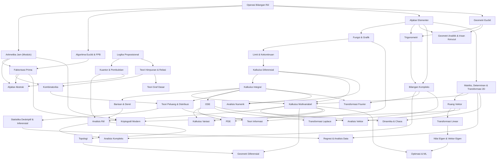

# Nalar: Peta Kurikulum & Roadmap Matematika

Peta kurikulum matematika **Nalar** dirancang berbasis pohon keterampilan (*Directed Acyclic Graph*), bergerak dari fondasi nalar konkret hingga cabang-cabang modern matematika murni dan terapan. Setiap topik adalah modul mandiri (*standalone*) dengan prasyarat eksplisit.

**Legenda Fase:**
- 🟢 **MVP** — Dibangun pertama, pondasi demo awal platform.
- 🔵 **v1.1** — Ekspansi gelombang kedua setelah MVP stabil.
- 🟣 **v2.0** — Materi lanjut dan spesialisasi jangka panjang.
- 🔘 **Opsional** — Topik pengayaan, tidak wajib untuk alur utama.

---

## Gambaran Arsitektur Kurikulum

```
                    [Level 1: Fondasi]
         ┌──────────┬──────────┬──────────┐
      [1A Bilangan] [1B Aljabar] [1C Geometri] [1D Logika]
         │          │          │              │
         └──────┬───┴──────────┴──────┬───────┘
                │                     │
           [Level 2: Perubahan & Struktur]
         ┌──────────┬──────────┐
      [2A Kalkulus] [2B Diskrit] [2C Kompleks]
         │          │            │
         └──────┬───┴────────────┘
                │
           [Level 3: Tiga Pilar]
         ┌──────────┬──────────┐
      [3A Aljabar  [3B Kalkulus [3C Probabilitas
       Linear]      Lanjut &    & Statistika]
                    ODE]
                │
       ┌────────┴────────┐
       ▼                 ▼
  [Cabang A]        [Cabang B]
  Murni              Terapan & Komputasi
  ├─ Analisis        ├─ Transformasi Integral
  ├─ Aljabar         ├─ Komputasi Numerik
  ├─ Topologi        ├─ Pemodelan & Optimasi
  └─ Var. Kalkulus   └─ Kriptografi
```

> [!IMPORTANT]
> **Cabang A dan Cabang B adalah jalur paralel** — dapat ditempuh bersamaan atau dipilih sesuai minat, bukan urutan sekuensial.

---

## Level 1: Fondasi Nalar & Bahasa Simbolik

Membangun bahasa matematika, penalaran logis, pemahaman bilangan, dan intuisi geometris.

### 1A · Bilangan & Aritmetika

* 🟢 **Operasi Bilangan Riil & Garis Bilangan**
  * Bilangan bulat, pecahan, desimal, rasio, eksponen, dan akar.
  * Hukum komutatif, asosiatif, dan distributif secara geometris.
  * *Visualisasi:* Garis bilangan interaktif dengan zoom tak hingga.
  * *Prasyarat:* —

* 🟢 **Aritmetika Jam (Modulo)**
  * Modulo sebagai rotasi jam, sifat siklis, sisa bagi.
  * Aritmetika modular: penjumlahan, perkalian, dan tabel mod $n$.
  * *Visualisasi:* Lingkaran modulo interaktif, pola kardioid & fraktal perkalian modular.
  * *Prasyarat:* Operasi Bilangan Riil

* 🟢 **Algoritma Euclid & FPB**
  * Pembagian berulang, FPB, KPK, dan identitas Bézout.
  * *Visualisasi:* Pengubinan persegi panjang dengan bujur sangkar terbesar.
  * *Prasyarat:* Operasi Bilangan Riil

* 🔵 **Faktorisasi Prima & Koprima**
  * Teorema dasar aritmetika — bilangan prima sebagai "atom" penyusun bilangan bulat.
  * Bilangan relatif prima (koprima), fungsi Euler totient $\phi(n)$.
  * *Visualisasi:* Pohon faktorisasi interaktif, animasi saringan Eratosthenes.
  * *Prasyarat:* Aritmetika Jam, Algoritma Euclid

### 1B · Aljabar & Fungsi

* 🟢 **Aljabar Elementer**
  * Variabel, manipulasi kesetaraan, pertidaksamaan, nilai mutlak.
  * Sistem persamaan linear dua variabel.
  * *Visualisasi:* Timbangan kesetaraan, perpotongan dua garis di bidang kartesius.
  * *Prasyarat:* Operasi Bilangan Riil

* 🟢 **Fungsi & Grafik**
  * Konsep fungsi, domain, kodomain, komposisi fungsi.
  * Jenis fungsi: polinomial, rasional, eksponensial, logaritma.
  * Transformasi grafik (translasi, refleksi, dilatasi).
  * *Visualisasi:* Grafik fungsi reaktif dengan slider parameter, animasi transformasi.
  * *Prasyarat:* Aljabar Elementer

### 1C · Geometri & Pengukuran

* 🟢 **Geometri Euclid**
  * Aksioma dasar, garis, sudut, segitiga, segi empat, lingkaran.
  * Kongruensi dan kesebangunan bangun datar.
  * Teorema Pythagoras — pembuktian visual melalui penataan luas.
  * *Visualisasi:* Pembuktian Pythagoras interaktif (seret bujur sangkar), konstruksi kompas dan penggaris virtual.
  * *Prasyarat:* Operasi Bilangan Riil

* 🟢 **Trigonometri & Lingkaran Satuan**
  * Rasio trigonometri ($\sin$, $\cos$, $\tan$) dan invers.
  * Lingkaran satuan, identitas trigonometri, grafik fungsi periodik.
  * Radian vs derajat.
  * *Visualisasi:* Lingkaran satuan interaktif dengan titik berjalan, grafik gelombang sinkron.
  * *Prasyarat:* Geometri Euclid, Aljabar Elementer
  * [🔗 Sains: Gerak melingkar, gelombang]

* 🔵 **Geometri Analitik & Irisan Kerucut**
  * Sistem koordinat kartesius, jarak, titik tengah, gradien.
  * Irisan kerucut: parabola, elips, hiperbola — persamaan umum dan sifat geometris.
  * *Visualisasi:* Pemotongan kerucut 3D interaktif yang menghasilkan kurva 2D, slider eksentrisitas.
  * *Prasyarat:* Aljabar Elementer, Geometri Euclid
  * [🔗 Sains: Orbit planet Kepler, cermin parabola, lensa optik]

### 1D · Logika & Penalaran Formal

* 🔵 **Logika Proposisional & Gerbang Logika**
  * Proposisi, konjungsi, disjungsi, negasi, implikasi ($P \Rightarrow Q$), biimplikasi.
  * Tabel kebenaran, ekuivalensi logis, hukum De Morgan.
  * *Visualisasi:* Simulator gerbang logika visual (seret & hubungkan), tabel kebenaran interaktif.
  * *Prasyarat:* —

* 🔵 **Kuantor & Metode Pembuktian**
  * Kuantor universal ($\forall$) dan eksistensial ($\exists$).
  * Metode: pembuktian langsung, kontradiksi, kontrapositif, dan induksi matematika.
  * *Visualisasi:* Pohon pembuktian interaktif, animasi langkah induksi (domino).
  * *Prasyarat:* Logika Proposisional

---

## Level 2: Perubahan, Struktur Diskrit & Bilangan Kompleks

Transisi dari pemikiran statis menuju matematika dinamis, struktural, dan perluasan sistem bilangan.

### 2A · Kalkulus Satu Variabel

* 🟢 **Limit & Kekontinuan**
  * Konsep limit intuitif dan formal ($\varepsilon$-$\delta$ sederhana).
  * Limit satu sisi, limit di tak hingga, kekontinuan fungsi.
  * Teorema nilai antara (*Intermediate Value Theorem*).
  * *Visualisasi:* Slider $\varepsilon$-$\delta$ interaktif, animasi pendekatan titik, deteksi diskontinuitas visual.
  * *Prasyarat:* Fungsi & Grafik

* 🟢 **Kalkulus Diferensial**
  * Turunan sebagai laju perubahan sesaat — garis sekan → garis tangen ($\Delta x \to 0$).
  * Aturan turunan: pangkat, rantai, hasil kali, hasil bagi.
  * Titik ekstrem, titik belok, uji turunan pertama/kedua.
  * *Visualisasi:* Animasi garis singgung mendekati titik, slider $\Delta x$, grafik $f'(x)$ sinkron.
  * *Prasyarat:* Limit & Kekontinuan
  * [🔗 Sains: Kinematika — kecepatan & percepatan sesaat]

* 🟢 **Kalkulus Integral**
  * Integral tentu sebagai akumulasi luas — Jumlah Riemann ($n \to \infty$).
  * Teorema Dasar Kalkulus — penghubung diferensial dan integral.
  * Teknik integrasi: substitusi, parsial.
  * *Visualisasi:* Persegi panjang di bawah kurva yang bertambah banyak, akumulator luas real-time.
  * *Prasyarat:* Kalkulus Diferensial
  * [🔗 Sains: Kerja & energi — integral gaya terhadap perpindahan]

* 🔵 **Barisan & Deret**
  * Barisan aritmetika, geometri; kekonvergenan dan divergensi.
  * Deret tak hingga, uji konvergensi, deret Taylor/Maclaurin.
  * *Visualisasi:* Penjumlahan parsial konvergen, animasi polinomial Taylor mendekati fungsi target.
  * *Prasyarat:* Kalkulus Integral

### 2B · Matematika Diskrit

* 🔵 **Teori Himpunan & Relasi**
  * Himpunan, operasi himpunan, diagram Venn, himpunan kuasa.
  * Relasi, fungsi sebagai relasi khusus, relasi ekuivalensi.
  * *Visualisasi:* Diagram Venn interaktif (seret elemen), visualisasi relasi sebagai graf bipartit.
  * *Prasyarat:* Logika Proposisional

* 🔵 **Kombinatorika & Pencacahan**
  * Prinsip pencacahan, permutasi, kombinasi, prinsip inklusi-eksklusi.
  * Segitiga Pascal, koefisien binomial.
  * *Visualisasi:* Segitiga Pascal interaktif, pohon pencacahan visual.
  * *Prasyarat:* Teori Himpunan, Faktorisasi Prima

* 🔵 **Teori Graf Dasar**
  * Simpul, sisi, derajat, graf berbobot, graf berarah.
  * Traversal BFS/DFS, jalur terpendek, pohon rentang.
  * *Visualisasi:* Graf interaktif dengan React Flow — seret simpul, jalankan algoritma traversal.
  * *Prasyarat:* Teori Himpunan
  * [🔗 Sains: Jaringan saraf, struktur molekul]

### 2C · Bilangan Kompleks

* 🔵 **Bilangan Kompleks: Aljabar & Geometri**
  * Satuan imajiner $i$, bentuk aljabar $a + bi$, bidang kompleks (Argand).
  * Operasi dasar: penjumlahan, perkalian, konjugat, modulus.
  * Bentuk polar $r(\cos\theta + i\sin\theta)$ dan formula Euler $e^{i\theta}$.
  * Akar ke-$n$ bilangan kompleks dan akar-akar persamaan.
  * *Visualisasi:* Bidang kompleks interaktif — seret titik, lihat operasi sebagai rotasi & penskalaan.
  * *Prasyarat:* Trigonometri, Aljabar Elementer
  * [🔗 Sains: Fasor arus bolak-balik, mekanika kuantum]

---

## Level 3: Tiga Pilar Utama (*Core Undergraduate*)

Tahap persimpangan utama sebelum mendalami cabang murni maupun terapan.

### 3A · Aljabar Linear

* 🟢 **Matriks, Determinan & Transformasi 2D**
  * Operasi matriks, determinan sebagai faktor pengali luas paralelogram.
  * Transformasi linear 2D: rotasi, refleksi, geser, skala.
  * Matriks singular dan invertibilitas.
  * *Visualisasi:* Grid basis $\hat{i}$/$\hat{j}$ yang bertransformasi, paralelogram dinamis.
  * *Prasyarat:* Aljabar Elementer

* 🔵 **Ruang Vektor & Sistem Persamaan Linear**
  * Vektor, kombinasi linear, rentang (*span*), independensi linear.
  * Basis, dimensi, ruang baris/kolom/nol.
  * Eliminasi Gauss, solusi sistem persamaan.
  * *Visualisasi:* Visualisasi span vektor 2D/3D, proyeksi interaktif.
  * *Prasyarat:* Matriks & Determinan 2D

* 🔵 **Transformasi Linear & Perubahan Basis**
  * Transformasi linear sebagai "mesin" matriks, kernel dan citra (*image*).
  * Matriks representasi, perubahan basis.
  * *Visualisasi:* Animasi perubahan basis, grid bertransformasi dalam basis berbeda.
  * *Prasyarat:* Ruang Vektor

* 🟣 **Nilai Eigen & Vektor Eigen**
  * Vektor yang mempertahankan arah di bawah transformasi matriks.
  * Persamaan karakteristik, diagonalisasi, dekomposisi spektral.
  * Singular Value Decomposition (SVD).
  * *Visualisasi:* Vektor eigen tetap pada sumbunya saat transformasi, animasi dekomposisi SVD.
  * *Prasyarat:* Transformasi Linear
  * [🔗 Sains: Mode vibrasi, analisis komponen utama (PCA)]

### 3B · Kalkulus Lanjut & Persamaan Diferensial

* 🟣 **Kalkulus Multivariabel**
  * Fungsi banyak variabel, turunan parsial, gradien.
  * Aturan rantai multivariabel, matriks Jacobian.
  * Titik kritis dan uji turunan kedua (matriks Hessian).
  * Integral lipat (ganda, rangkap tiga), transformasi koordinat (polar, silinder, bola).
  * *Visualisasi:* Permukaan 3D interaktif, medan gradien, kontur level.
  * *Prasyarat:* Kalkulus Diferensial, Kalkulus Integral, Matriks & Determinan 2D
  * [🔗 Sains: Medan gravitasi, potensial listrik]

* 🟣 **Analisis Vektor**
  * Medan vektor 2D/3D, divergensi, *curl*, operator nabla ($\nabla$).
  * Integral garis, integral permukaan.
  * Teorema Green, Stokes, dan Divergensi (Gauss).
  * *Visualisasi:* Medan vektor interaktif — arus fluida, divergensi/curl sebagai animasi partikel.
  * *Prasyarat:* Kalkulus Multivariabel, Ruang Vektor
  * [🔗 Sains: Persamaan Maxwell, dinamika fluida]

* 🔵 **Persamaan Diferensial Biasa (ODE)**
  * Persamaan orde-1: pemisahan variabel, faktor integrasi, persamaan eksak.
  * Persamaan orde-2: osilator harmonik, koefisien tak tentu, variasi parameter.
  * Sistem ODE, diagram fase, stabilitas titik kesetimbangan.
  * *Visualisasi:* Bidang arah (*slope fields*) interaktif, kurva solusi real-time, diagram fase 2D.
  * *Prasyarat:* Kalkulus Integral
  * [🔗 Sains: Osilasi pegas, sirkuit RLC, peluruhan radioaktif]

### 3C · Probabilitas & Statistika

* 🔵 **Teori Peluang & Distribusi**
  * Ruang sampel, peluang bersyarat, Teorema Bayes.
  * Variabel acak diskrit dan kontinu.
  * Distribusi: binomial, Poisson, normal, eksponensial.
  * *Visualisasi:* Simulasi eksperimen Monte Carlo untuk $\pi$, Papan Galton interaktif.
  * *Prasyarat:* Kombinatorika, Kalkulus Integral
  * [🔗 Sains: Mekanika statistik, pewarisan genetik]

* 🔵 **Statistika Deskriptif & Inferensial**
  * Ukuran pemusatan (mean, median, modus), dispersi (varians, standar deviasi).
  * Interval kepercayaan, uji hipotesis (uji-z, uji-t, chi-square).
  * Tingkat signifikansi ($\alpha$), *p-value*, kesalahan tipe I/II.
  * *Visualisasi:* Distribusi sampling interaktif, slider ukuran sampel → CLT real-time.
  * *Prasyarat:* Teori Peluang
  * [🔗 Sains: Desain eksperimen, analisis data laboratorium]

* 🔵 **Regresi & Analisis Data**
  * Regresi linear sederhana dan berganda, metode kuadrat terkecil.
  * Korelasi vs kausalitas, koefisien determinasi $R^2$.
  * Regresi polinomial, *overfitting*, validasi silang dasar.
  * *Visualisasi:* Titik data interaktif (seret titik → garis regresi berubah), residual plot.
  * *Prasyarat:* Statistika Deskriptif, Matriks & Determinan 2D
  * [🔗 Sains: Kurva kalibrasi, prediksi data eksperimen]

---

## Cabang A: Matematika Murni

Eksplorasi pembuktian formal yang ketat (*rigorous*), keindahan aksiomatis, dan struktur ruang abstrak.

### A1 · Analisis

* 🟣 **Analisis Riil**
  * Aksioma kelengkapan bilangan riil, supremum & infimum.
  * Barisan Cauchy, kekonvergenan, ruang metrik.
  * Definisi $\varepsilon$-$\delta$ formal untuk limit dan kekontinuan.
  * Kekontinuan seragam, integral Lebesgue.
  * *Visualisasi:* Animasi $\varepsilon$-$\delta$ formal, barisan Cauchy konvergen di garis bilangan.
  * *Prasyarat:* Barisan & Deret, Kuantor & Pembuktian, Kalkulus Multivariabel

* 🟣 **Analisis Kompleks**
  * Fungsi bernilai kompleks, fungsi holomorfik, persamaan Cauchy-Riemann.
  * Deret Laurent, residu, dan integral kontur.
  * Pemetaan konformal dan transformasi Möbius.
  * *Visualisasi:* Pemetaan konformal interaktif (domain → kodomain), animasi kontur integral.
  * *Prasyarat:* Analisis Riil, Bilangan Kompleks

### A2 · Struktur Aljabar

* 🟣 **Aljabar Abstrak**
  * Grup: definisi aksiomatis, grup siklis, grup permutasi, grup simetri.
  * Subgrup, koset, Teorema Lagrange.
  * Gelanggang (*ring*), medan (*field*), homomorfisme.
  * Pengenalan Teori Galois — ketaktersolvabilitas persamaan kuintik.
  * *Visualisasi:* Tabel Cayley interaktif, visualisasi grup simetri bangun (rotasi & refleksi), grup wallpaper.
  * *Prasyarat:* Kuantor & Pembuktian, Aritmetika Jam, Faktorisasi Prima

### A3 · Geometri & Topologi

* 🟣 **Topologi**
  * Ruang topologis, himpunan terbuka/tertutup, kekompakan, keterhubungan.
  * Homeomorfisme — "geometri karet" (cangkir kopi ≅ donat).
  * Pita Möbius, botol Klein, klasifikasi permukaan.
  * *Visualisasi:* Deformasi interaktif (mug → donat), pembuatan pita Möbius 3D.
  * *Prasyarat:* Analisis Riil

* 🟣 **Geometri Diferensial**
  * Kurva dan permukaan berparameter, vektor tangen, vektor normal.
  * Manifold mulus, kelengkungan Gauss, geodesik.
  * Pengantar tensor kelengkungan Riemann.
  * *Visualisasi:* Permukaan 3D interaktif dengan kelengkungan berkode warna, jalur geodesik.
  * *Prasyarat:* Kalkulus Multivariabel, Topologi
  * [🔗 Sains: Relativitas umum — ruang-waktu lengkung]

### A4 · Analisis Variasi

* 🔘 **Kalkulus Variasi** *(opsional)*
  * Fungsional dan variasi pertama.
  * Persamaan Euler-Lagrange — mencari fungsi yang memaksimalkan/meminimalkan fungsional.
  * Brakisokron, geodesik, prinsip aksi terkecil.
  * *Visualisasi:* Kurva brakisokron interaktif (seret titik start/end → kurva optimal berubah), perbandingan waktu tempuh.
  * *Prasyarat:* Kalkulus Multivariabel, ODE
  * [🔗 Sains: Mekanika Lagrangian/Hamiltonian, prinsip Fermat optik]

---

## Cabang B: Matematika Terapan & Komputasi Modern

Pemanfaatan struktur matematika untuk merancang model, simulasi, algoritma, dan optimasi.

### B1 · Persamaan & Transformasi Integral

* 🟣 **Persamaan Diferensial Parsial (PDE)**
  * Klasifikasi PDE: eliptik, parabolik, hiperbolik.
  * Persamaan gelombang, persamaan difusi panas (Fourier), persamaan Laplace.
  * Syarat batas dan syarat awal.
  * *Visualisasi:* Perambatan gelombang 2D interaktif, simulasi difusi panas.
  * *Prasyarat:* Kalkulus Multivariabel, ODE
  * [🔗 Sains: Gelombang mekanik, konduksi termal, elektrostatika]

* 🔵 **Transformasi Fourier & Analisis Frekuensi**
  * Deret Fourier — dekomposisi fungsi periodik menjadi jumlahan sinusoidal.
  * Transformasi Fourier kontinu dan diskrit (DFT/FFT).
  * Spektrum frekuensi, filter, dan konvolusi.
  * *Visualisasi:* Animasi "epicycles" (lingkaran berputar menyusun bentuk), spektogram interaktif, dekomposisi sinyal.
  * *Prasyarat:* Kalkulus Integral, Bilangan Kompleks
  * [🔗 Sains: Pemrosesan sinyal audio, analisis spektrum cahaya, MRI]

* 🟣 **Transformasi Laplace & Sistem Kontrol**
  * Definisi transformasi Laplace, tabel transformasi dasar.
  * Penyelesaian ODE dengan Laplace, fungsi transfer.
  * Pengantar teori kontrol: stabilitas, diagram Bode.
  * *Visualisasi:* Domain-$s$ interaktif (plot kutub-nol), diagram Bode dinamis.
  * *Prasyarat:* ODE, Bilangan Kompleks
  * [🔗 Sains: Sistem kontrol robotik, sirkuit elektrik]

### B2 · Komputasi Numerik

* 🔵 **Analisis Numerik & Komputasi Ilmiah**
  * Pencarian akar: metode Newton-Raphson, metode bagi dua (*bisection*).
  * Interpolasi: polinomial Lagrange, splines kubik.
  * Integrasi numerik: aturan trapesium, Simpson, kuadratur Gauss.
  * Error numerik: pembulatan, stabilitas algoritma, kondisi (*conditioning*).
  * *Visualisasi:* Animasi konvergensi Newton-Raphson (bola meluncur ke akar), perbandingan metode integrasi.
  * *Prasyarat:* Kalkulus Diferensial, Kalkulus Integral

### B3 · Pemodelan & Optimasi

* 🟣 **Teori Optimasi & Pembelajaran Mesin**
  * Optimasi tanpa kendala: *gradient descent*, laju pembelajaran, momentum.
  * Optimasi berkendala: pengali Lagrange, pemrograman linear dasar.
  * Kontur permukaan fungsi rugi (*loss surface*), minimum lokal vs global.
  * *Visualisasi:* Bola menggelinding di *loss surface* 3D, jejak *gradient descent*, slider laju pembelajaran.
  * *Prasyarat:* Kalkulus Multivariabel, Nilai Eigen
  * [🔗 Sains: Pelatihan jaringan saraf, pemodelan data eksperimen]

* 🟣 **Dinamika Sistem & Teori Chaos**
  * Peta logistik dan diagram bifurkasi.
  * Penarik aneh (*strange attractors*): Lorenz, Rössler.
  * Sensitivitas terhadap kondisi awal (*Butterfly Effect*), eksponen Lyapunov.
  * *Visualisasi:* Simulasi Lorenz Attractor 3D, diagram bifurkasi interaktif (slider parameter $r$).
  * *Prasyarat:* ODE, Matriks & Determinan 2D
  * [🔗 Sains: Meteorologi, dinamika populasi, dinamika fluida turbulen]

### B4 · Matematika Informasi & Keamanan

* 🟣 **Kriptografi Modern**
  * Aritmetika modular dan eksponensasi modular cepat.
  * Algoritma RSA — enkripsi kunci publik.
  * Kriptografi kurva eliptik (ECC) — operasi titik pada kurva.
  * *Visualisasi:* Operasi titik pada kurva eliptik interaktif, animasi alur enkripsi/dekripsi RSA.
  * *Prasyarat:* Aritmetika Jam, Faktorisasi Prima, Ruang Vektor

* 🔘 **Teori Informasi** *(opsional)*
  * Entropi Shannon, informasi mutual, kapasitas kanal.
  * Kompresi data dan *error-correcting codes* dasar.
  * *Visualisasi:* Visualisasi entropi (slider distribusi → bar entropi berubah), simulasi transmisi data berderau.
  * *Prasyarat:* Teori Peluang, Logaritma (Fungsi & Grafik)
  * [🔗 Sains: Telekomunikasi, kompresi sinyal biologis]

---

## Prerequisite Graph (Peta Prasyarat)

Relasi prasyarat eksplisit yang menjadi data source implementasi **Skill Tree** (React Flow).



### Ringkasan Prasyarat (Tabel Referensi Cepat)

| Topik | Prasyarat Langsung |
| :--- | :--- |
| Aritmetika Jam | Operasi Bilangan Riil |
| Algoritma Euclid | Operasi Bilangan Riil |
| Faktorisasi Prima | Aritmetika Jam, Algoritma Euclid |
| Aljabar Elementer | Operasi Bilangan Riil |
| Fungsi & Grafik | Aljabar Elementer |
| Geometri Euclid | Operasi Bilangan Riil |
| Trigonometri | Geometri Euclid, Aljabar Elementer |
| Geometri Analitik | Aljabar Elementer, Geometri Euclid |
| Logika Proposisional | — |
| Kuantor & Pembuktian | Logika Proposisional |
| Limit & Kekontinuan | Fungsi & Grafik |
| Kalkulus Diferensial | Limit & Kekontinuan |
| Kalkulus Integral | Kalkulus Diferensial |
| Barisan & Deret | Kalkulus Integral |
| Teori Himpunan | Logika Proposisional |
| Kombinatorika | Teori Himpunan, Faktorisasi Prima |
| Teori Graf | Teori Himpunan |
| Bilangan Kompleks | Trigonometri, Aljabar Elementer |
| Matriks & Determinan 2D | Aljabar Elementer |
| Ruang Vektor | Matriks & Determinan 2D |
| Transformasi Linear | Ruang Vektor |
| Nilai Eigen | Transformasi Linear |
| Kalkulus Multivariabel | Kalkulus Diferensial, Kalkulus Integral, Matriks & Determinan 2D |
| Analisis Vektor | Kalkulus Multivariabel, Ruang Vektor |
| ODE | Kalkulus Integral |
| Teori Peluang | Kombinatorika, Kalkulus Integral |
| Statistika Inferensial | Teori Peluang |
| Regresi & Analisis Data | Statistika Inferensial, Matriks & Determinan 2D |
| Analisis Riil | Barisan & Deret, Kuantor & Pembuktian, Kalkulus Multivariabel |
| Analisis Kompleks | Analisis Riil, Bilangan Kompleks |
| Aljabar Abstrak | Kuantor & Pembuktian, Aritmetika Jam, Faktorisasi Prima |
| Topologi | Analisis Riil |
| Geometri Diferensial | Kalkulus Multivariabel, Topologi |
| Kalkulus Variasi | Kalkulus Multivariabel, ODE |
| PDE | Kalkulus Multivariabel, ODE |
| Transformasi Fourier | Kalkulus Integral, Bilangan Kompleks |
| Transformasi Laplace | ODE, Bilangan Kompleks |
| Analisis Numerik | Kalkulus Diferensial, Kalkulus Integral |
| Optimasi & ML | Kalkulus Multivariabel, Nilai Eigen |
| Dinamika & Chaos | ODE, Matriks & Determinan 2D |
| Kriptografi Modern | Aritmetika Jam, Faktorisasi Prima, Ruang Vektor |
| Teori Informasi | Teori Peluang, Fungsi & Grafik (logaritma) |
