# Nalar: Peta Kurikulum & Roadmap Sains

Peta kurikulum sains **Nalar** dirancang berbasis pohon keterampilan (*Directed Acyclic Graph*), mencakup tiga pilar utama sains: **Fisika**, **Kimia**, dan **Biologi**. Setiap topik adalah modul mandiri (*standalone*) dengan prasyarat eksplisit dan simulasi kanvas interaktif.

**Legenda Fase:**
- 🟢 **MVP** — Dibangun pertama, pondasi demo awal platform.
- 🔵 **v1.1** — Ekspansi gelombang kedua setelah MVP stabil.
- 🟣 **v2.0** — Materi lanjut dan spesialisasi jangka panjang.
- 🔘 **Opsional** — Topik pengayaan, tidak wajib untuk alur utama.

**Legenda Pilar:**
- ⚛️ Fisika
- 🧪 Kimia
- 🧬 Biologi

---

## Gambaran Arsitektur Kurikulum

```
                       [Level 1: Fondasi Sains]
         ┌───────────┬───────────┬───────────┐
      [1A Metode]  [1B Mekanika] [1C Materi] [1D Kehidupan]
       (Lintas)     ⚛️            🧪          🧬
         │          │             │            │
         └────┬─────┴─────────────┴────┬───────┘
              │                        │
             [Level 2: Interaksi & Energi]
      ┌──────────┬──────────┬──────────┐
   [2A Osilasi  [2B Listrik [2C Reaksi [2D Genetika
    & Gelombang] & Magnet]   Kimia]     & Evolusi]
      ⚛️          ⚛️          🧪         🧬
              │
         [Level 3: Sistem & Hukum Universal]
      ┌──────────┬──────────┬──────────┐
   [3A Termo   [3B Elektro- [3C Kimia  [3D Ekologi
    & Fluida]   magnetisme]  Lanjut]    & Bumi]
      ⚛️          ⚛️          🧪         🧬
              │
     ┌────────┴────────┐
     ▼                 ▼
[Cabang A]        [Cabang B]
Fisika Modern     Sains Terapan
& Kosmologi       & Teknologi
├─ Relativitas    ├─ Elektronika
├─ Kuantum        ├─ Bioteknologi
├─ Nuklir         ├─ Material
└─ Astrofisika    └─ Energi Hijau
```

> [!IMPORTANT]
> **Cabang A dan Cabang B adalah jalur paralel** — dapat ditempuh bersamaan atau dipilih sesuai minat, bukan urutan sekuensial.

---

## Level 1: Fondasi Sains

Membangun pemikiran ilmiah, pemahaman gerak & gaya, struktur materi, dan dasar kehidupan.

### 1A · Metode & Pengukuran *(Lintas Pilar)*

* 🟢 **Metode Ilmiah & Desain Eksperimen**
  * Siklus: observasi → hipotesis → eksperimen → analisis → kesimpulan.
  * Variabel bebas, terikat, dan kontrol. Bias dan validitas.
  * *Visualisasi:* Simulator eksperimen virtual — atur variabel, jalankan, lihat hasil, tarik kesimpulan.
  * *Prasyarat:* —

* 🟢 **Besaran, Satuan SI & Analisis Dimensi**
  * Besaran pokok dan turunan, konversi satuan, notasi ilmiah.
  * Angka penting (*significant figures*) dan ketidakpastian pengukuran.
  * Analisis dimensi — menguji kebenaran persamaan fisika.
  * *Visualisasi:* Penggaris/neraca/stopwatch virtual interaktif, kalkulator konversi dinamis.
  * *Prasyarat:* —
  * [🔗 Matematika: Operasi Bilangan Riil]

### 1B · Mekanika ⚛️

* 🟢 **Kinematika**
  * Gerak lurus: GLB (kecepatan konstan), GLBB (percepatan konstan), jatuh bebas.
  * Gerak 2D: gerak parabola (proyektil) — dekomposisi komponen horizontal & vertikal.
  * Grafik $x$-$t$, $v$-$t$, $a$-$t$ dan hubungannya.
  * *Visualisasi:* Kanon proyektil interaktif (atur sudut & kecepatan awal → jejak parabola), grafik sinkron real-time.
  * *Prasyarat:* Besaran & Satuan
  * [🔗 Matematika: Fungsi & Grafik, Trigonometri]

* 🟢 **Dinamika & Hukum Newton**
  * Hukum I (inersia), Hukum II ($\vec{F} = m\vec{a}$), Hukum III (aksi-reaksi).
  * Gaya-gaya: normal, gesek (statik & kinetik), tegangan tali, pegas.
  * Diagram benda bebas (*free body diagram*).
  * Bidang miring — dekomposisi gaya pada sudut kemiringan.
  * *Visualisasi:* Benda di atas bidang miring interaktif (slider sudut, koefisien gesek), diagram gaya otomatis.
  * *Prasyarat:* Kinematika
  * [🔗 Matematika: Aljabar Elementer, Trigonometri]

* 🟢 **Usaha, Energi & Kekekalan Energi**
  * Usaha ($W = \vec{F} \cdot \vec{d}$), energi kinetik, energi potensial gravitasi & pegas.
  * Hukum kekekalan energi mekanik, gaya konservatif vs non-konservatif.
  * Daya ($P = W/t$).
  * *Visualisasi:* Roller coaster interaktif — bar chart energi kinetik/potensial berubah sinkron sepanjang lintasan.
  * *Prasyarat:* Dinamika
  * [🔗 Matematika: Kalkulus Integral (integral gaya)]

* 🔵 **Momentum, Impuls & Tumbukan**
  * Momentum linear ($\vec{p} = m\vec{v}$), impuls ($\vec{J} = \vec{F}\Delta t$).
  * Hukum kekekalan momentum, tumbukan lenting sempurna & tak sempurna.
  * Pusat massa dan sistem banyak partikel.
  * *Visualisasi:* Simulator tumbukan 2D (atur massa & kecepatan → animasi sebelum/sesudah tumbukan), bar chart momentum.
  * *Prasyarat:* Usaha & Energi
  * [🔗 Matematika: Aljabar Elementer]

* 🔵 **Gerak Melingkar & Gravitasi Universal**
  * Gerak melingkar beraturan: kecepatan sudut ($\omega$), percepatan sentripetal, gaya sentripetal.
  * Hukum gravitasi Newton ($F = G\frac{m_1 m_2}{r^2}$), medan gravitasi.
  * Hukum Kepler: orbit elips, hukum luas, hukum periode.
  * Kecepatan orbital dan kecepatan lepas (*escape velocity*).
  * *Visualisasi:* Simulator orbit planet interaktif — seret planet, ubah massa/jarak → orbit berubah real-time.
  * *Prasyarat:* Dinamika, Usaha & Energi
  * [🔗 Matematika: Geometri Analitik (elips), Trigonometri]

### 1C · Materi & Atom 🧪

* 🟢 **Struktur Atom & Tabel Periodik**
  * Model atom: Dalton → Thomson → Rutherford → Bohr → mekanika kuantum (orbital).
  * Nomor atom, nomor massa, isotop.
  * Konfigurasi elektron dan tabel periodik — tren sifat: jari-jari, energi ionisasi, keelektronegatifan.
  * *Visualisasi:* Model atom interaktif (zoom dari inti ke orbital), tabel periodik dinamis (klik elemen → visualisasi kulit elektron).
  * *Prasyarat:* Metode Ilmiah
  * [🔗 Matematika: Operasi Bilangan Riil]

* 🔵 **Ikatan Kimia & Geometri Molekul**
  * Ikatan ionik, kovalen, dan logam — transfer vs berbagi elektron.
  * Struktur Lewis, oktet, muatan formal.
  * Teori VSEPR — prediksi bentuk molekul 3D (linear, bengkok, tetrahedral, dll).
  * Polaritas molekul dan gaya antarmolekul (London, dipol-dipol, ikatan hidrogen).
  * *Visualisasi:* Pembangun molekul 3D interaktif — gabungkan atom, lihat geometri VSEPR otomatis.
  * *Prasyarat:* Struktur Atom
  * [🔗 Matematika: Geometri Euclid, Trigonometri]

* 🔵 **Wujud Zat & Perubahan Fase**
  * Sifat partikel pada fase padat, cair, gas, dan plasma.
  * Perubahan fase: melebur, menguap, menyublim, mengkristal.
  * Diagram fase, titik tripel, dan titik kritis.
  * *Visualisasi:* Simulasi partikel (*particle simulation*) — slider suhu/tekanan → partikel berubah perilaku (padat→cair→gas).
  * *Prasyarat:* Struktur Atom
  * [🔗 Matematika: Fungsi & Grafik]

### 1D · Kehidupan & Sel 🧬

* 🔵 **Sel, Organel & Membran**
  * Sel prokariot vs eukariot, organel dan fungsinya.
  * Membran sel: model mosaik fluida, transpor (difusi, osmosis, transpor aktif).
  * Mitosis dan siklus sel.
  * *Visualisasi:* Model sel 3D interaktif (klik organel → zoom & penjelasan), simulasi osmosis (slider konsentrasi).
  * *Prasyarat:* Metode Ilmiah
  * [🔗 Matematika: Operasi Bilangan Riil (konsentrasi, rasio)]

* 🔵 **Biomolekul & Metabolisme**
  * Empat makromolekul: karbohidrat, lipid, protein, asam nukleat.
  * Monomer → polimer, ikatan peptida, struktur protein (primer→kuarter).
  * Enzim sebagai katalis biologis, kinetika enzim dasar (Michaelis-Menten).
  * Respirasi sel (glikolisis → siklus Krebs → rantai transpor elektron) dan fotosintesis.
  * *Visualisasi:* Animasi lipat protein, simulator enzim-substrat (slider konsentrasi → kurva laju reaksi).
  * *Prasyarat:* Sel & Organel, Struktur Atom
  * [🔗 Matematika: Fungsi & Grafik (kurva Michaelis-Menten)]

---

## Level 2: Interaksi & Energi

Memperluas pemahaman tentang gelombang, medan gaya, transformasi kimia, dan informasi genetik.

### 2A · Osilasi & Gelombang ⚛️

* 🟢 **Gerak Harmonik Sederhana (GHS)**
  * Osilator pegas dan bandul sederhana.
  * Persamaan GHS: $x(t) = A\cos(\omega t + \phi)$, kecepatan, dan percepatan.
  * Energi dalam GHS: pertukaran energi kinetik ↔ potensial.
  * Resonansi dan redaman.
  * *Visualisasi:* Bandul interaktif (slider panjang tali/massa → periode berubah), grafik $x(t)$ sinkron, bar chart energi.
  * *Prasyarat:* Usaha & Energi
  * [🔗 Matematika: Trigonometri, Kalkulus Diferensial, ODE]

* 🟢 **Gelombang Mekanik & Bunyi**
  * Gelombang transversal dan longitudinal, amplitudo, frekuensi, panjang gelombang.
  * Kecepatan gelombang ($v = \lambda f$), superposisi, interferensi, gelombang berdiri.
  * Bunyi: intensitas, desibel, resonansi tabung, efek Doppler.
  * *Visualisasi:* Simulasi gelombang tali (slider frekuensi/amplitudo), superposisi dua gelombang, animasi efek Doppler (sumber bergerak).
  * *Prasyarat:* Gerak Harmonik Sederhana
  * [🔗 Matematika: Trigonometri, Fungsi & Grafik]

* 🔵 **Cahaya & Optika Geometri**
  * Sifat cahaya: kecepatan cahaya, pemantulan, pembiasan (Hukum Snell).
  * Cermin datar, cermin cekung/cembung — persamaan cermin dan pembesaran.
  * Lensa tipis (konvergen/divergen), pembentukan bayangan, persamaan lensa.
  * Alat optik: mata, kaca pembesar, mikroskop, teleskop.
  * *Visualisasi:* Ray tracer interaktif (seret sumber cahaya → sinar pantul/bias berubah), pembentukan bayangan real-time.
  * *Prasyarat:* Gelombang Mekanik
  * [🔗 Matematika: Geometri Euclid, Geometri Analitik (parabola cermin)]

* 🟣 **Optika Fisis**
  * Interferensi celah ganda Young — pola gelap/terang.
  * Difraksi celah tunggal, kisi difraksi.
  * Polarisasi cahaya.
  * *Visualisasi:* Simulasi celah ganda interaktif (slider jarak celah → pola interferensi berubah), animasi polarisasi.
  * *Prasyarat:* Cahaya & Optika Geometri
  * [🔗 Matematika: Trigonometri, Bilangan Kompleks]

### 2B · Listrik & Magnet ⚛️

* 🟢 **Elektrostatika & Medan Listrik**
  * Muatan listrik, Hukum Coulomb ($F = k\frac{q_1 q_2}{r^2}$).
  * Medan listrik: garis medan, prinsip superposisi.
  * Potensial listrik, beda potensial, energi potensial listrik.
  * Kapasitor: kapasitansi, energi tersimpan, dielektrik.
  * *Visualisasi:* Simulator medan listrik — letakkan muatan (seret), lihat garis medan & kontur potensial berubah real-time.
  * *Prasyarat:* Usaha & Energi
  * [🔗 Matematika: Geometri Analitik, Kalkulus Integral]

* 🟢 **Arus Listrik & Rangkaian DC**
  * Arus, tegangan, hambatan, Hukum Ohm ($V = IR$).
  * Rangkaian seri dan paralel, Hukum Kirchhoff (arus & tegangan).
  * Daya listrik, energi disipasi, GGL dan hambatan dalam.
  * *Visualisasi:* Circuit builder interaktif — seret komponen (baterai, resistor, lampu), ukur arus/tegangan, lihat aliran elektron.
  * *Prasyarat:* Elektrostatika
  * [🔗 Matematika: Aljabar Elementer (sistem persamaan Kirchhoff)]

* 🔵 **Kemagnetan & Gaya Lorentz**
  * Medan magnet, garis medan, magnet permanen.
  * Gaya Lorentz pada muatan bergerak ($\vec{F} = q\vec{v} \times \vec{B}$) — gerak melingkar di medan magnetik.
  * Gaya pada kawat berarus dalam medan magnet, motor listrik sederhana.
  * Medan magnetik dari kawat lurus (Biot-Savart) dan solenoida.
  * *Visualisasi:* Partikel bermuatan bergerak melingkar di medan magnet (slider kecepatan/medan), animasi motor listrik.
  * *Prasyarat:* Arus Listrik, Gerak Melingkar & Gravitasi
  * [🔗 Matematika: Analisis Vektor (perkalian silang)]

### 2C · Reaksi & Transformasi Kimia 🧪

* 🔵 **Stoikiometri & Persamaan Reaksi**
  * Penyetaraan persamaan reaksi kimia.
  * Konsep mol, massa molar, bilangan Avogadro.
  * Pereaksi pembatas, hasil teoritis, dan persen hasil.
  * *Visualisasi:* Timbangan molekul virtual (seret reaktan → produk berubah proporsional), kalkulator stoikiometri interaktif.
  * *Prasyarat:* Struktur Atom, Ikatan Kimia
  * [🔗 Matematika: Aljabar Elementer (rasio & proporsi)]

* 🔵 **Termokimia & Energetika Reaksi**
  * Reaksi eksoterm dan endoterm, perubahan entalpi ($\Delta H$).
  * Hukum Hess, entalpi pembentukan standar.
  * Diagram energi dan kalorimetri.
  * *Visualisasi:* Diagram energi interaktif (slider ketinggian → $\Delta H$ berubah), simulasi kalorimeter virtual.
  * *Prasyarat:* Stoikiometri, Usaha & Energi
  * [🔗 Matematika: Aljabar Elementer, Kalkulus Integral]

* 🔵 **Laju Reaksi & Kesetimbangan Kimia**
  * Faktor laju reaksi: konsentrasi, suhu, katalis, luas permukaan.
  * Orde reaksi dan persamaan laju, energi aktivasi (persamaan Arrhenius).
  * Kesetimbangan dinamis, tetapan kesetimbangan ($K$), prinsip Le Chatelier.
  * *Visualisasi:* Simulasi partikel bertumbukan (slider suhu → frekuensi tumbukan berubah), grafik konsentrasi → kesetimbangan real-time.
  * *Prasyarat:* Termokimia
  * [🔗 Matematika: Kalkulus Diferensial (laju perubahan), Fungsi & Grafik (eksponensial Arrhenius)]

### 2D · Genetika & Informasi Biologis 🧬

* 🔵 **DNA, RNA & Sintesis Protein**
  * Struktur double helix DNA, pasangan basa komplementer (A-T, G-C).
  * Replikasi DNA — semikonservatif.
  * Transkripsi (DNA → mRNA) dan translasi (mRNA → protein), kodon & antikodon.
  * *Visualisasi:* Animasi double helix interaktif (zoom → basa nitrogen), simulator transkripsi/translasi (klik kodon → asam amino muncul).
  * *Prasyarat:* Biomolekul
  * [🔗 Matematika: Kombinatorika (jumlah kodon)]

* 🔵 **Genetika Mendel & Pewarisan Sifat**
  * Hukum segregasi dan hukum pengelompokan bebas Mendel.
  * Genotip, fenotip, dominan, resesif, kodominan.
  * Diagram Punnett — probabilitas pewarisan sifat.
  * Pautan gen, pindah silang (*crossing over*), pewarisan terpaut seks.
  * *Visualisasi:* Diagram Punnett interaktif (pilih alel induk → prediksi keturunan), simulasi pewarisan multi-generasi.
  * *Prasyarat:* DNA & Sintesis Protein
  * [🔗 Matematika: Teori Peluang (probabilitas keturunan), Kombinatorika]

* 🟣 **Mutasi, Variasi & Evolusi**
  * Jenis mutasi: titik, insersi, delesi, kromosom.
  * Seleksi alam, adaptasi, spesiasi.
  * Bukti evolusi: fosil, anatomi komparatif, biologi molekuler.
  * Genetika populasi dasar: frekuensi alel, kesetimbangan Hardy-Weinberg.
  * *Visualisasi:* Simulasi seleksi alam (populasi dengan variasi warna → predator → perubahan frekuensi alel selama generasi).
  * *Prasyarat:* Genetika Mendel
  * [🔗 Matematika: Teori Peluang, Statistika Inferensial]

---

## Level 3: Sistem & Hukum Universal

Mensintesis konsep-konsep sebelumnya ke dalam sistem berskala besar dan hukum-hukum fundamental.

### 3A · Termodinamika & Fluida ⚛️

* 🔵 **Hukum Termodinamika & Entropi**
  * Hukum ke-0 (kesetimbangan termal), Hukum I (kekekalan energi: $\Delta U = Q - W$).
  * Proses termodinamika: isotermal, adiabatik, isobarik, isokhorik.
  * Hukum II: entropi dan arah proses spontan, siklus Carnot.
  * Hukum III: nol mutlak.
  * *Visualisasi:* Diagram P-V interaktif (seret piston → proses termodinamika, hitung kerja sebagai luas di bawah kurva), animasi siklus Carnot.
  * *Prasyarat:* Usaha & Energi, Wujud Zat
  * [🔗 Matematika: Kalkulus Integral (luas di bawah kurva P-V)]

* 🟣 **Gas Ideal & Teori Kinetik**
  * Persamaan gas ideal ($PV = nRT$), hukum Boyle, Charles, Gay-Lussac.
  * Teori kinetik: hubungan suhu ↔ energi kinetik rata-rata partikel.
  * Distribusi kecepatan Maxwell-Boltzmann.
  * *Visualisasi:* Kotak gas interaktif (slider suhu/volume → partikel bergerak, histogram kecepatan Maxwell-Boltzmann berubah real-time).
  * *Prasyarat:* Termodinamika, Wujud Zat
  * [🔗 Matematika: Teori Peluang (distribusi), Kalkulus Integral]

* 🔵 **Mekanika Fluida**
  * Statika fluida: tekanan hidrostatis ($P = \rho g h$), hukum Pascal, hukum Archimedes.
  * Dinamika fluida: persamaan kontinuitas, persamaan Bernoulli.
  * Viskositas dan aliran laminar vs turbulen (bilangan Reynolds).
  * *Visualisasi:* Simulasi tangki fluida (slider kedalaman → tekanan berubah), simulasi aliran Bernoulli (pipa menyempit → kecepatan naik).
  * *Prasyarat:* Dinamika, Usaha & Energi
  * [🔗 Matematika: Kalkulus Integral, Kalkulus Multivariabel]

### 3B · Elektromagnetisme Lanjut ⚛️

* 🔵 **Induksi Elektromagnetik**
  * Fluks magnetik dan Hukum Faraday ($\varepsilon = -\frac{d\Phi_B}{dt}$).
  * Hukum Lenz — arah arus induksi melawan perubahan fluks.
  * Generator listrik dan transformator.
  * *Visualisasi:* Magnet bergerak menembus kumparan → grafik GGL & arus sinkron, simulator generator interaktif.
  * *Prasyarat:* Kemagnetan
  * [🔗 Matematika: Kalkulus Diferensial (laju perubahan fluks), Kalkulus Integral]

* 🟣 **Rangkaian AC, Impedansi & Resonansi**
  * Tegangan dan arus sinusoidal, nilai efektif (RMS).
  * Rangkaian RLC: impedansi, faktor daya, resonansi.
  * Representasi fasor.
  * *Visualisasi:* Simulator rangkaian AC (slider frekuensi → diagram fasor berputar, kurva resonansi berubah).
  * *Prasyarat:* Induksi EM, Gerak Harmonik Sederhana
  * [🔗 Matematika: Bilangan Kompleks (representasi fasor), Trigonometri]

* 🟣 **Gelombang Elektromagnetik & Spektrum EM**
  * Persamaan Maxwell (kualitatif): medan listrik berubah → medan magnet, dan sebaliknya.
  * Gelombang EM: kecepatan cahaya, perambatan di ruang hampa.
  * Spektrum EM: radio, mikro, inframerah, tampak, UV, sinar-X, gamma — frekuensi dan energi.
  * *Visualisasi:* Animasi gelombang EM (medan $\vec{E}$ dan $\vec{B}$ berosilasi tegak lurus), slider frekuensi → posisi di spektrum EM.
  * *Prasyarat:* Induksi EM, Gelombang Mekanik
  * [🔗 Matematika: PDE (persamaan gelombang), Analisis Vektor]

### 3C · Kimia Lanjut 🧪

* 🔵 **Asam-Basa, pH & Larutan Buffer**
  * Teori asam-basa: Arrhenius, Brønsted-Lowry, Lewis.
  * Skala pH, ionisasi air, dan $K_a$/$K_b$.
  * Titrasi asam-basa, titik ekuivalen, indikator.
  * Larutan buffer dan kapasitas buffer.
  * *Visualisasi:* Skala pH interaktif (teteskan asam/basa → warna indikator & nilai pH berubah), kurva titrasi dinamis (slider volume titran).
  * *Prasyarat:* Laju Reaksi & Kesetimbangan
  * [🔗 Matematika: Fungsi & Grafik (skala logaritmik)]

* 🟣 **Elektrokimia**
  * Reaksi redoks: oksidasi, reduksi, penyetaraan.
  * Sel volta (Galvani): potensial sel standar, deret aktivitas, persamaan Nernst.
  * Elektrolisis dan hukum Faraday elektrolisis.
  * *Visualisasi:* Simulasi sel volta interaktif (pilih elektroda → GGL terhitung otomatis, animasi aliran elektron).
  * *Prasyarat:* Asam-Basa, Arus Listrik & Rangkaian DC
  * [🔗 Matematika: Fungsi & Grafik (persamaan Nernst logaritmik)]

* 🟣 **Kimia Organik Dasar**
  * Kekhasan atom karbon, rantai karbon, dan hibridisasi.
  * Gugus fungsi utama: alkohol, aldehida, keton, asam karboksilat, amina, ester.
  * Isomeri: struktural, geometri (cis/trans), optis (kiral).
  * Reaksi dasar: substitusi, adisi, eliminasi.
  * *Visualisasi:* Pembangun molekul organik 3D (drag & drop atom → struktur 3D otomatis), pengenal gugus fungsi.
  * *Prasyarat:* Ikatan Kimia
  * [🔗 Matematika: Geometri Euclid (geometri tetrahedral)]

### 3D · Ekologi & Sistem Bumi 🧬

* 🔵 **Ekosistem, Jaring Makanan & Piramida Ekologi**
  * Tingkat trofik: produsen, konsumen, dekomposer.
  * Rantai makanan, jaring makanan, dan aliran energi (aturan 10%).
  * Piramida ekologi: energi, biomassa, jumlah.
  * Dinamika populasi: pertumbuhan eksponensial vs logistik, kapasitas dukung (*carrying capacity*).
  * *Visualisasi:* Jaring makanan interaktif (React Flow — seret spesies, lihat dampak penghapusan predator), grafik populasi Lotka-Volterra.
  * *Prasyarat:* Biomolekul, Metode Ilmiah
  * [🔗 Matematika: Fungsi & Grafik (eksponensial, logistik), ODE (model populasi)]

* 🟣 **Siklus Biogeokimia & Perubahan Iklim**
  * Siklus karbon, nitrogen, air, dan fosfor.
  * Efek rumah kaca, pemanasan global, dan jejak karbon.
  * Dampak aktivitas manusia terhadap ekosistem.
  * *Visualisasi:* Diagram siklus karbon interaktif (slider emisi → konsentrasi CO₂ & suhu global berubah), simulasi efek rumah kaca.
  * *Prasyarat:* Ekosistem, Termokimia
  * [🔗 Matematika: Statistika Inferensial (analisis tren data iklim)]

---

## Cabang A: Fisika Modern & Kosmologi ⚛️

Memasuki revolusi fisika abad ke-20 — relativitas, kuantum, dan alam semesta.

### A1 · Relativitas

* 🟣 **Relativitas Khusus**
  * Postulat Einstein: kecepatan cahaya konstan, hukum fisika sama di semua kerangka inersia.
  * Dilatasi waktu ($\Delta t' = \gamma \Delta t$), kontraksi panjang ($L' = L/\gamma$).
  * Kesetaraan massa-energi ($E = mc^2$), momentum relativistik.
  * Diagram ruang-waktu Minkowski.
  * *Visualisasi:* Simulator dilatasi waktu (slider kecepatan → jam melambat), animasi kontraksi panjang, diagram Minkowski interaktif.
  * *Prasyarat:* Kinematika, Usaha & Energi
  * [🔗 Matematika: Aljabar Linear (transformasi Lorentz), Geometri Analitik]

### A2 · Mekanika Kuantum

* 🟣 **Dualitas Gelombang-Partikel & Efek Kuantum**
  * Radiasi benda hitam dan hipotesis Planck ($E = hf$).
  * Efek fotolistrik — foton sebagai partikel cahaya.
  * Hipotesis de Broglie: partikel berperilaku seperti gelombang ($\lambda = h/p$).
  * Prinsip ketidakpastian Heisenberg.
  * *Visualisasi:* Simulasi efek fotolistrik (slider frekuensi → elektron terpancar atau tidak), animasi pola difraksi elektron.
  * *Prasyarat:* Gelombang Mekanik, Struktur Atom
  * [🔗 Matematika: Fungsi & Grafik, Teori Peluang]

* 🟣 **Model Atom Kuantum & Persamaan Schrödinger**
  * Fungsi gelombang ($\Psi$), interpretasi probabilistik ($|\Psi|^2$).
  * Persamaan Schrödinger tak bergantung waktu (sumur potensial sederhana).
  * Orbital atom (s, p, d, f) sebagai densitas probabilitas 3D.
  * Efek terowongan kuantum (*quantum tunneling*).
  * *Visualisasi:* Orbital atom 3D interaktif (pilih bilangan kuantum → bentuk orbital), simulasi tunneling (slider energi/lebar penghalang).
  * *Prasyarat:* Dualitas Gelombang-Partikel
  * [🔗 Matematika: Bilangan Kompleks, ODE, Aljabar Linear (ruang Hilbert)]

### A3 · Fisika Nuklir

* 🟣 **Inti Atom, Radioaktivitas & Reaksi Nuklir**
  * Struktur inti: proton, neutron, gaya nuklir kuat.
  * Energi ikat per nukleon, kurva stabilitas, defek massa.
  * Radioaktivitas: peluruhan alfa ($\alpha$), beta ($\beta$), gamma ($\gamma$), waktu paruh.
  * Fisi nuklir (pembelahan inti berat) dan fusi nuklir (penggabungan inti ringan).
  * *Visualisasi:* Kurva energi ikat interaktif, simulasi peluruhan radioaktif (slider waktu → jumlah inti meluruh, grafik $N(t) = N_0 e^{-\lambda t}$), animasi reaksi fisi/fusi.
  * *Prasyarat:* Struktur Atom, Usaha & Energi
  * [🔗 Matematika: Fungsi & Grafik (peluruhan eksponensial), Kalkulus Diferensial]

### A4 · Astrofisika

* 🔘 **Kosmologi & Astrofisika** *(opsional)*
  * Siklus hidup bintang: diagram Hertzsprung-Russell.
  * Lubang hitam, bintang neutron, supernova.
  * Teori Big Bang, radiasi latar belakang kosmik (CMB), ekspansi alam semesta (Hukum Hubble).
  * Materi gelap dan energi gelap.
  * *Visualisasi:* Diagram HR interaktif (klik bintang → info fase kehidupan), simulasi ekspansi alam semesta (slider waktu → galaksi menjauh).
  * *Prasyarat:* Fisika Nuklir, Gravitasi Universal
  * [🔗 Matematika: Geometri Diferensial (ruang-waktu lengkung), Statistika]

---

## Cabang B: Sains Terapan & Teknologi

Aplikasi prinsip-prinsip sains fundamental dalam teknologi, industri, dan tantangan dunia nyata.

### B1 · Elektronika

* 🟣 **Semikonduktor, Dioda & Transistor**
  * Semikonduktor intrinsik dan ekstrinsik (doping tipe-n, tipe-p).
  * Sambungan p-n, dioda, dan penyearah.
  * Transistor bipolar (BJT) sebagai saklar dan penguat.
  * Gerbang logika fisik — jembatan ke komputasi digital.
  * *Visualisasi:* Animasi pergerakan elektron/hole di sambungan p-n, simulator gerbang logika (LED menyala/mati berdasarkan input).
  * *Prasyarat:* Arus Listrik, Struktur Atom
  * [🔗 Matematika: Logika Proposisional, Fungsi & Grafik (kurva karakteristik I-V)]

### B2 · Bioteknologi

* 🟣 **Rekayasa Genetika & CRISPR**
  * Teknik rekayasa DNA: PCR, elektroforesis gel, kloning gen.
  * Sistem CRISPR-Cas9: mekanisme potong-tempel gen.
  * Organisasi termodifikasi genetis (GMO), terapi gen, dan bioetika.
  * *Visualisasi:* Simulator CRISPR interaktif (pilih sekuens target → animasi pemotongan & penyisipan DNA), simulasi elektroforesis gel.
  * *Prasyarat:* DNA & Sintesis Protein, Genetika Mendel
  * [🔗 Matematika: Kombinatorika (sekuens DNA)]

### B3 · Material

* 🔘 **Sains Material & Nanoteknologi** *(opsional)*
  * Struktur kristal, polimer, keramik, komposit.
  * Sifat material: kekuatan, elastisitas, konduktivitas.
  * Nanomaterial: karbon nanotube, graphene, quantum dots.
  * *Visualisasi:* Struktur kristal 3D interaktif (putar, zoom), simulasi uji tarik material (slider gaya → kurva tegangan-regangan).
  * *Prasyarat:* Ikatan Kimia, Wujud Zat
  * [🔗 Matematika: Geometri Euclid (simetri kristal), Aljabar Linear (tensor tegangan)]

### B4 · Keberlanjutan

* 🔘 **Energi Berkelanjutan & Teknologi Hijau** *(opsional)*
  * Sumber energi terbarukan: surya (fotovoltaik), angin, air, geotermal.
  * Efisiensi konversi energi, sel bahan bakar hidrogen.
  * Jejak karbon, siklus hidup produk, dan ekonomi sirkular.
  * *Visualisasi:* Dashboard energi interaktif (slider bauran energi → emisi karbon & biaya berubah), simulator panel surya (slider sudut/awan → output daya).
  * *Prasyarat:* Termodinamika, Siklus Biogeokimia
  * [🔗 Matematika: Optimasi (maksimasi efisiensi), Statistika (analisis data energi)]

---

## Prerequisite Graph (Peta Prasyarat)

Relasi prasyarat eksplisit yang menjadi data source implementasi **Skill Tree** (React Flow).

```mermaid
graph TD
    %% ====== LEVEL 1A: Metode ======
    M1["Metode Ilmiah"]
    M2["Besaran & Satuan"]

    %% ====== LEVEL 1B: Mekanika ======
    P1["Kinematika"]
    P2["Dinamika & Hukum Newton"]
    P3["Usaha & Energi"]
    P4["Momentum & Tumbukan"]
    P5["Gerak Melingkar & Gravitasi"]

    M2 --> P1
    P1 --> P2
    P2 --> P3
    P3 --> P4
    P2 --> P5
    P3 --> P5

    %% ====== LEVEL 1C: Materi ======
    K1["Struktur Atom & Periodik"]
    K2["Ikatan Kimia"]
    K3["Wujud Zat & Fase"]

    M1 --> K1
    K1 --> K2
    K1 --> K3

    %% ====== LEVEL 1D: Kehidupan ======
    B1["Sel & Organel"]
    B2["Biomolekul & Metabolisme"]

    M1 --> B1
    B1 --> B2
    K1 --> B2

    %% ====== LEVEL 2A: Osilasi & Gelombang ======
    W1["Gerak Harmonik Sederhana"]
    W2["Gelombang Mekanik & Bunyi"]
    W3["Optika Geometri"]
    W4["Optika Fisis"]

    P3 --> W1
    W1 --> W2
    W2 --> W3
    W3 --> W4

    %% ====== LEVEL 2B: Listrik & Magnet ======
    E1["Elektrostatika"]
    E2["Arus Listrik & Rangkaian DC"]
    E3["Kemagnetan & Gaya Lorentz"]

    P3 --> E1
    E1 --> E2
    E2 --> E3
    P5 --> E3

    %% ====== LEVEL 2C: Kimia Reaksi ======
    R1["Stoikiometri"]
    R2["Termokimia"]
    R3["Laju Reaksi & Kesetimbangan"]

    K1 --> R1
    K2 --> R1
    R1 --> R2
    P3 --> R2
    R2 --> R3

    %% ====== LEVEL 2D: Genetika ======
    G1["DNA & Sintesis Protein"]
    G2["Genetika Mendel"]
    G3["Mutasi, Variasi & Evolusi"]

    B2 --> G1
    G1 --> G2
    G2 --> G3

    %% ====== LEVEL 3A: Termo & Fluida ======
    T1["Termodinamika & Entropi"]
    T2["Gas Ideal & Teori Kinetik"]
    T3["Mekanika Fluida"]

    P3 --> T1
    K3 --> T1
    T1 --> T2
    K3 --> T2
    P2 --> T3
    P3 --> T3

    %% ====== LEVEL 3B: EM Lanjut ======
    EM1["Induksi Elektromagnetik"]
    EM2["Rangkaian AC"]
    EM3["Gelombang EM & Spektrum"]

    E3 --> EM1
    EM1 --> EM2
    W1 --> EM2
    EM1 --> EM3
    W2 --> EM3

    %% ====== LEVEL 3C: Kimia Lanjut ======
    KL1["Asam-Basa & pH"]
    KL2["Elektrokimia"]
    KL3["Kimia Organik"]

    R3 --> KL1
    KL1 --> KL2
    E2 --> KL2
    K2 --> KL3

    %% ====== LEVEL 3D: Ekologi ======
    EK1["Ekosistem & Jaring Makanan"]
    EK2["Siklus Biogeokimia"]

    B2 --> EK1
    M1 --> EK1
    EK1 --> EK2
    R2 --> EK2

    %% ====== CABANG A: Fisika Modern ======
    FA1["Relativitas Khusus"]
    FA2["Dualitas Gelombang-Partikel"]
    FA3["Model Atom Kuantum"]
    FA4["Fisika Nuklir"]
    FA5["Kosmologi & Astrofisika"]

    P1 --> FA1
    P3 --> FA1
    W2 --> FA2
    K1 --> FA2
    FA2 --> FA3
    K1 --> FA4
    P3 --> FA4
    FA4 --> FA5
    P5 --> FA5

    %% ====== CABANG B: Terapan ======
    TB1["Semikonduktor & Elektronika"]
    TB2["Rekayasa Genetika & CRISPR"]
    TB3["Sains Material"]
    TB4["Energi Berkelanjutan"]

    E2 --> TB1
    K1 --> TB1
    G1 --> TB2
    G2 --> TB2
    K2 --> TB3
    K3 --> TB3
    T1 --> TB4
    EK2 --> TB4
```



### Ringkasan Prasyarat (Tabel Referensi Cepat)

| Topik | Prasyarat Langsung |
| :--- | :--- |
| **Level 1** | |
| Kinematika | Besaran & Satuan |
| Dinamika | Kinematika |
| Usaha & Energi | Dinamika |
| Momentum & Tumbukan | Usaha & Energi |
| Gerak Melingkar & Gravitasi | Dinamika, Usaha & Energi |
| Struktur Atom | Metode Ilmiah |
| Ikatan Kimia | Struktur Atom |
| Wujud Zat | Struktur Atom |
| Sel & Organel | Metode Ilmiah |
| Biomolekul & Metabolisme | Sel & Organel, Struktur Atom |
| **Level 2** | |
| Gerak Harmonik Sederhana | Usaha & Energi |
| Gelombang Mekanik & Bunyi | GHS |
| Optika Geometri | Gelombang Mekanik |
| Optika Fisis | Optika Geometri |
| Elektrostatika | Usaha & Energi |
| Arus Listrik & Rangkaian DC | Elektrostatika |
| Kemagnetan | Arus Listrik, Gerak Melingkar |
| Stoikiometri | Struktur Atom, Ikatan Kimia |
| Termokimia | Stoikiometri, Usaha & Energi |
| Laju Reaksi & Kesetimbangan | Termokimia |
| DNA & Sintesis Protein | Biomolekul |
| Genetika Mendel | DNA & Sintesis Protein |
| Mutasi & Evolusi | Genetika Mendel |
| **Level 3** | |
| Termodinamika | Usaha & Energi, Wujud Zat |
| Gas Ideal & Teori Kinetik | Termodinamika, Wujud Zat |
| Mekanika Fluida | Dinamika, Usaha & Energi |
| Induksi Elektromagnetik | Kemagnetan |
| Rangkaian AC | Induksi EM, GHS |
| Gelombang EM | Induksi EM, Gelombang Mekanik |
| Asam-Basa & pH | Laju Reaksi & Kesetimbangan |
| Elektrokimia | Asam-Basa, Arus Listrik |
| Kimia Organik | Ikatan Kimia |
| Ekosistem | Biomolekul, Metode Ilmiah |
| Siklus Biogeokimia | Ekosistem, Termokimia |
| **Cabang A** | |
| Relativitas Khusus | Kinematika, Usaha & Energi |
| Dualitas Gelombang-Partikel | Gelombang Mekanik, Struktur Atom |
| Model Atom Kuantum | Dualitas Gelombang-Partikel |
| Fisika Nuklir | Struktur Atom, Usaha & Energi |
| Kosmologi & Astrofisika | Fisika Nuklir, Gravitasi Universal |
| **Cabang B** | |
| Semikonduktor | Arus Listrik, Struktur Atom |
| Rekayasa Genetika | DNA, Genetika Mendel |
| Sains Material | Ikatan Kimia, Wujud Zat |
| Energi Berkelanjutan | Termodinamika, Siklus Biogeokimia |
